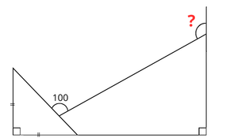

# 📝 Latihan Input & Output

Kerjakan latihan berikut:

---

## 🟢 Soal 1 (Mudah)

Buat program yang meminta input:
- nama

Lalu tampilkan:

```text
Halo [nama]
```

---

## 🟡 Soal 2 (Sedang)

Buat program:
- input nama
- input umur

Tampilkan:

```text
Nama saya [nama]
Umur saya [umur] tahun
```

---

## 🔴 Soal 3 (Berpikir)

- Buat program untuk menghitung luas segitiga, dengan variabel :
- Wajib menggunakan fungsi `print()` serta `input()` 
    - alas
    - tinggi

lalu tampilkan
```text
=== LUAS SEGITIGA ===
alas  : 6 cm
tinggi  : 10 cm
luas : 30 cm2
====================
```
---

# 🚀 Challenge



- Buat 1 variabel `derajat = 100`
- Tidak boleh ada variabel lain, buat program untuk menghitung hasil sudut yang ditanyakan
- Program harus runtut (tidak boleh langsung jawaban)

---

# 📂 Simpan File

```text
latihan03.py
```

Simpan di:

```text
pengumpulan/nama_kamu/
```

---

# 🎯 Tujuan Latihan

- Memahami input dari user
- Mengolah data
- Menggunakan aritmatika
- Memperkuat logika dasar

---

Semangat! 💪

# 🚀 Materi Selanjutnya

👉 [04 - Percabangan](../04-percabangan/)