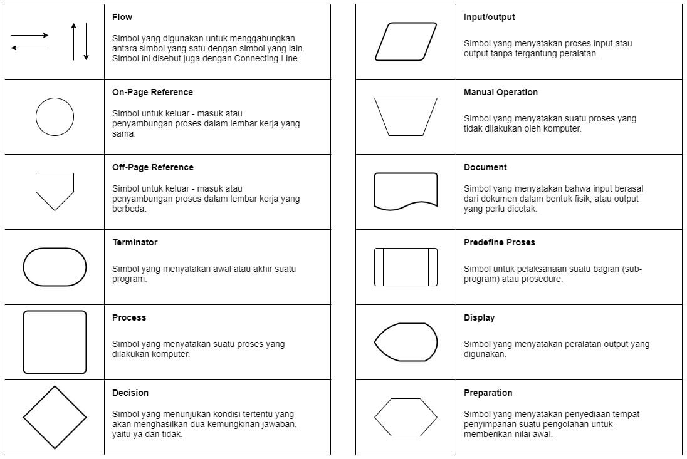
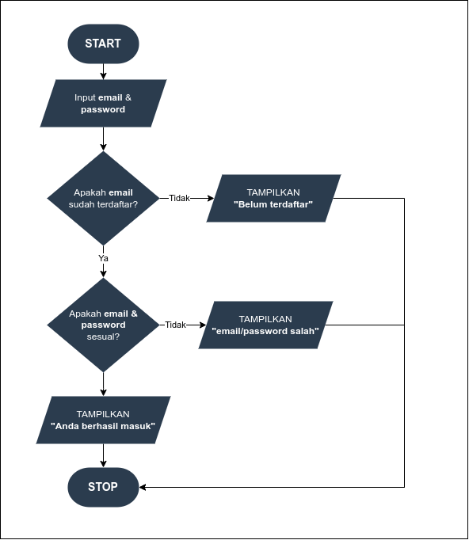

# 🔀 Flowchart (Diagram Alur)

Flowchart adalah cara untuk **menggambarkan alur logika program** menggunakan simbol-simbol.

---

# 🎯 Tujuan

- Memahami alur program sebelum coding
- Melatih logika berpikir
- Mempermudah debugging

---

# 🧠 Kenapa Flowchart Penting?

Sebelum menulis kode, programmer biasanya:

👉 berpikir  
👉 merancang alur  
👉 baru coding  

Flowchart membantu kita agar:
- tidak bingung saat coding
- tahu langkah-langkah program
- menghindari error logika

---

# 🔤 Simbol Dasar Flowchart



---

# 🖼️ Contoh Flowchart Sederhana




---

# 🔁 Hubungan dengan Python

Flowchart ini jika diubah ke Python:

```python
umur = int(input("Masukkan umur: "))

if umur >= 17:
    print("Dewasa")
else:
    print("Belum Dewasa")
```

---

# ⚠️ Tips Membuat Flowchart

- Gunakan simbol yang benar
- Alur harus jelas (atas → bawah)
- Jangan lompat-lompat
- Satu langkah = satu proses

---

# 🚀 Kesimpulan

- Flowchart membantu memahami logika program
- Sangat berguna sebelum coding
- Berhubungan langsung dengan `if-else`
